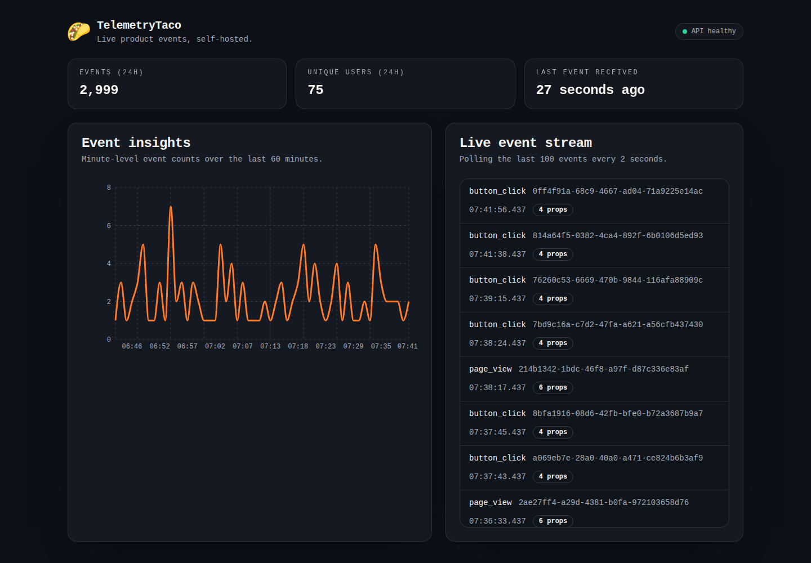

# TelemetryTaco

TelemetryTaco is a lightweight self-hosted telemetry MVP built around three concrete workflows:

- capture single events or batches
- inspect recent events in a live dashboard
- query minute-level insight aggregates over a recent lookback window



The codebase now targets a strong single-project MVP rather than a broad PostHog clone. The refactor in this repo keeps the current API contract intact while adding real batching, idempotency, generated frontend types, tests, and a cleaner developer workflow.

## Current Architecture

```text
Python SDK / API clients
        |
        v
  Django + Django Ninja
        |
        v
 Celery batch task queue
        |
        v
 PostgreSQL event store
        |
        v
 React dashboard (React Query + generated OpenAPI types)
```

### Runtime responsibilities

- `backend/`: API surface, ingestion service, selectors, Celery tasks, retention commands
- `frontend/`: dashboard UI, React Query polling, OpenAPI-generated TypeScript types
- `sdk/`: queue-backed Python client that batches to `/api/capture/batch`

## What Exists Today

- `POST /api/capture`: additive single-event capture endpoint
- `POST /api/capture/batch`: batch capture endpoint used by the SDK
- `GET /api/events`: bounded recent-event feed with optional `before` cursor
- `GET /api/insights`: bounded minute-level aggregate series
- `GET /api/stats`: event count, unique `distinct_id`s and last received event for the dashboard header
- `GET /api/health/live` and `GET /api/health/ready`
- event idempotency via caller-supplied `event_uuid`
- OpenAPI export and generated frontend types
- backend pytest coverage, frontend Vitest coverage, and SDK tests

## Quick Start

With Docker, one command runs the whole stack (Postgres, Redis, the API, the Celery worker and beat, and the dashboard) and seeds demo events on first boot:

```bash
docker compose up
```

Open http://localhost:5173. The API is on http://localhost:8000. `docker compose down` stops it and keeps your data, and `docker compose down -v` deletes it.

### Local development

Prerequisites:

- Python 3.11, 3.12, or 3.13
- Poetry 2.x
- Node.js 22.22+ or 24 and `pnpm`
- Docker, for Postgres and Redis
- `make`

```bash
make setup   # install dependencies and the pre-commit hooks
make dev     # Postgres and Redis in Docker, then the API, worker, beat and frontend
make seed    # optional: add demo events
```

The settings defaults match `make dev`. To change one, copy `backend/.env.example` to `backend/.env` and edit it.

`make dev` runs the processes in `Procfile.dev` with [honcho](https://honcho.readthedocs.io/), in one terminal with one log stream. Ctrl-C stops all of them. `make down` stops Postgres and Redis.

### Useful commands

`make help` lists every target. The common ones:

```bash
make types       # export the backend OpenAPI schema and regenerate frontend types
make lint        # Ruff, Bandit, ESLint, Prettier and tsc
make fmt         # fix lint issues and format everything
make test        # backend, frontend and SDK tests
make validate    # what CI runs that needs no Docker: types, lint, Django check, tests, build
make seed ARGS="--clean --count 5000"   # wipe and reseed demo events
```

## Production Images

Tagged releases publish two images to GHCR. `make images` builds the same images locally.

- `ghcr.io/agile-flimflam/telemetrytaco-backend` runs gunicorn as a non-root user, with only the main dependencies installed. Run the worker and beat from the same image by overriding the command.
- `ghcr.io/agile-flimflam/telemetrytaco-frontend` is nginx serving the built dashboard on port 8080. It proxies `/api`, `/admin` and `/static` to `API_UPSTREAM` (default `http://backend:8000`).

| Process | Command |
|---|---|
| Migrations, once per deploy | `python manage.py migrate --noinput` |
| API (the default) | `gunicorn config.wsgi` |
| Worker | `celery -A config worker` |
| Beat, exactly one | `celery -A config beat --schedule /tmp/celerybeat-schedule` |

The backend image uses `config.settings.production`, which needs `SECRET_KEY` (50+ characters), `DATABASE_URL`, `REDIS_URL`, `CACHE_URL` and `ALLOWED_HOSTS` (your public hostname). Behind the frontend image, set `TRUSTED_PROXY_COUNT=1`. Gunicorn reads `PORT` (default 8000), `WEB_CONCURRENCY` (default two workers per CPU) and `GUNICORN_TIMEOUT` (default 30). There's no authentication yet (#30), so don't expose a deployment publicly.

## Backend Notes

The backend defaults to development settings via `config.settings`.

Available settings modules:

- `config.settings.development`
- `config.settings.test`
- `config.settings.production`

Important environment variables:

- `DATABASE_URL`
- `REDIS_URL`
- `CACHE_URL`
- `MAX_CAPTURE_BATCH_SIZE`
- `MAX_EVENT_PROPERTIES_BYTES` (default 32768)
- `MAX_EVENTS_LIMIT`
- `MAX_INSIGHTS_LOOKBACK_MINUTES`
- `EVENT_RETENTION_DAYS`
- `RATE_LIMIT_CAPTURE_EVENT`, `RATE_LIMIT_LIST_EVENTS`, `RATE_LIMIT_GET_INSIGHTS` (per client IP, for example `1000/h`)
- `TRUSTED_PROXY_COUNT`

Rate limits are per client IP. Behind a reverse proxy or load balancer, every request arrives from the proxy's address, so all clients would share one limit. Set `TRUSTED_PROXY_COUNT` to the number of proxies in front of the backend (usually 1) and the client IP is read from `X-Forwarded-For` instead. Leave it at 0 when clients can reach the backend directly, since they could forge that header.

Events older than `EVENT_RETENTION_DAYS` (0 disables it) are purged every hour by Celery beat, in chunks of `EVENT_RETENTION_DELETE_BATCH_SIZE` rows. Docker Compose and `make dev` both run beat as its own process. In production, run exactly one `celery -A config beat` process. You can also purge by hand:

```bash
cd backend
poetry run python manage.py purge_expired_events
```

OpenAPI export is also explicit:

```bash
cd backend
DJANGO_SETTINGS_MODULE=config.settings.test poetry run python manage.py export_openapi_schema ../frontend/openapi.json
```

## Frontend Notes

The dashboard is a Vite React app that uses:

- React Query for polling, deduping, and error handling
- lazy loading for the chart surface
- generated API types from `frontend/openapi.json`

If the backend contract changes, regenerate types before committing:

```bash
make types
```

The dev server proxies `/api` to `http://localhost:8000`. Set `API_PROXY_TARGET` to proxy somewhere else; `docker compose` sets it to the `backend` service.

## SDK Example

```python
from telemetry_taco import TelemetryTaco

with TelemetryTaco(base_url="http://localhost:8000") as client:
    client.capture(
        distinct_id="user-123",
        event_name="feature_used",
        properties={"feature_name": "insights-refresh"},
    )
```

The SDK batches events in a background worker, attaches `event_uuid`, `timestamp` and `sent_at`, and flushes automatically when the context manager exits. Pass `timestamp=` to `capture()` to record an event that happened earlier, such as a backfill. If a script exits without closing the client, queued events are still sent at exit, waiting at most `exit_timeout` seconds (default 5).

## API Summary

### `POST /api/capture`

```json
{
  "distinct_id": "user-123",
  "event_name": "page_view",
  "properties": {
    "path": "/"
  },
  "event_uuid": "optional-uuid",
  "timestamp": "YYYY-MM-DDTHH:MM:SSZ",
  "sent_at": "YYYY-MM-DDTHH:MM:SSZ"
}
```

`timestamp` is when the event happened and `sent_at` is when the request left the client, both optional. With both, the server corrects for a wrong client clock by keeping the gap between them and anchoring it to the time it received the request. With only `timestamp`, it's stored as is. With only `sent_at`, it's used as the event time, as before `timestamp` existed. With neither, the server's receive time is used. An event time more than a minute in the future is replaced with the receive time.

`distinct_id` and `event_name` must be 1 to 255 characters. `properties` may be at most `MAX_EVENT_PROPERTIES_BYTES` once serialized as JSON. No string may contain a NUL character. Anything else is rejected with HTTP 422, and in a batch one invalid event rejects the whole request, so nothing is accepted and then lost later.

Response:

```json
{
  "status": "ok"
}
```

### `POST /api/capture/batch`

```json
{
  "events": [
    {
      "distinct_id": "user-123",
      "event_name": "page_view"
    }
  ]
}
```

The response's `accepted` is the number of distinct `event_uuid`s in the request. An event whose `event_uuid` was already stored is accepted but not stored again.

### `GET /api/events?limit=100&before=YYYY-MM-DDTHH:MM:SSZ,EVENT_ID`

Returns recent events ordered by `timestamp desc, id desc`.
For stable pagination, set `before` to the last event's `timestamp,id` pair.
Plain ISO 8601 timestamps are still accepted for backward compatibility.

### `GET /api/insights?lookback_minutes=60`

Returns one point per minute for the last `lookback_minutes` minutes, oldest first, ending with the current minute. Minutes without events have a count of 0, so the series always has `lookback_minutes` points (capped at `MAX_INSIGHTS_LOOKBACK_MINUTES`).

```json
[
  { "bucket": "2026-10-04T18:04:00Z", "time": "18:04", "count": 4 }
]
```

`bucket` is the start of the minute in UTC; format it in the viewer's time zone. `time` is the same minute as `HH:MM` in UTC and is deprecated, kept for older clients.

### `GET /api/stats`

Returns a summary of the last 24 hours plus when the most recent event arrived:

```json
{
  "events_last_24h": 2999,
  "unique_distinct_ids_last_24h": 75,
  "last_event_received_at": "2026-10-04T07:42:00.310Z"
}
```

## Developer Workflow

- Use the `Makefile` at the repo root for day-to-day commands (`make help`).
- Treat `backend/poetry.lock` and `pnpm-lock.yaml` as the dependency source of truth.
- Do not reintroduce `npm` lockfiles or a standalone backend `requirements.txt`.
- Keep frontend API types generated from the backend schema, not hand-maintained.

## Status

TelemetryTaco is intentionally not solving multi-tenancy, auth, cohorts, funnels, feature flags, or ClickHouse analytics yet. The current code is optimized for a maintainable ingestion-and-dashboard MVP with clean seams for future expansion.

## License

TelemetryTaco is released under the [MIT License](LICENSE).
